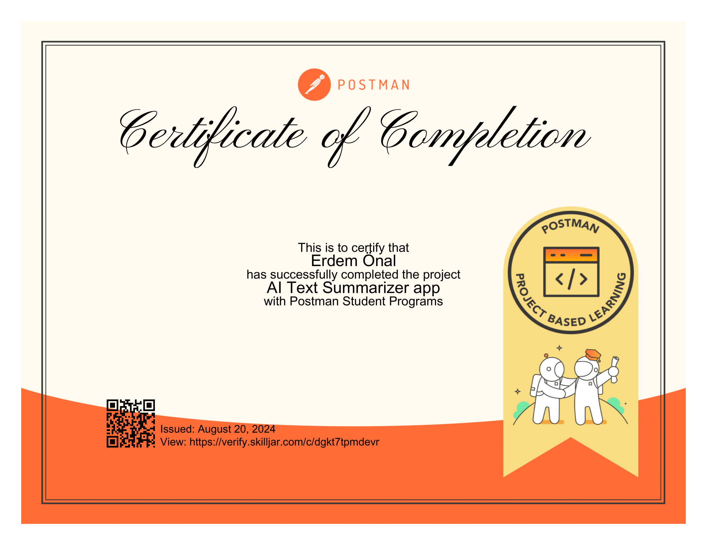

# AI Text Summarizer App

Welcome to the **AI Text Summarizer App**! This project was developed to explore real-world APIs and full-stack development. The app utilizes the Hugging Face Inference API to summarize lengthy text documents using AI.

## About This Course

This project is part of a Postman module where you'll learn:

- **Building and deploying a full-stack app** on Replit using HTML, CSS, JavaScript, and Node.js.
- **Exploring real-world APIs** with Postman, including the Hugging Face Inference API for text summarization.
- **Generating code with Postman** and integrating APIs into an application.

## Features

- **Summarize Text:** Paste your text into the input field, and the app will return a concise summary using AI.
- **Real-Time API Integration:** Utilizes Hugging Face's `facebook/bart-large-cnn` model for text summarization.
- **Responsive Design:** Designed to be responsive, ensuring a seamless experience across different devices.

## Project Structure

```plaintext
├── public
│   ├── images
│   │   └── certificate.png
│   ├── stylesheet.css
│   └── script.js
├── summarize.js
├── app.js
└── README.md
```

## Setup Instructions

1. **Clone the repository:**

    ```bash
    git clone https://github.com/erdemonal11/ai-text-summarizer.git
    ```

2. **Navigate to the project directory:**

    ```bash
    cd ai-text-summarizer
    ```

3. **Install dependencies:**

    ```bash
    npm install
    ```

4. **Set up environment variables:**
   - Create a `.env` file in the root directory and add your Hugging Face API key:

     ```plaintext
     ACCESS_TOKEN=your_huggingface_api_key
     ```

5. **Start the application:**

    ```bash
    node app.js
    ```

6. **Visit the application:**
   - Open your browser and go to [http://localhost:3000](http://localhost:3000) to use the app.


## Certificate


